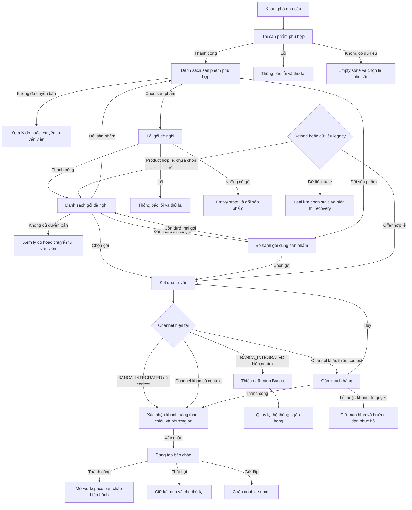

# User flow — Tư vấn sản phẩm, gói và chuyển bản chào Banca

## 1. User Flow tổng

## 2. Danh sách màn hình và trạng thái

1. `recommended-products` — danh sách sản phẩm duy nhất theo nhu cầu; gồm loading, empty, load-error và unavailable.
2. `recommended-packages` — gói thuộc sản phẩm đã chọn; gồm loading, empty, load-error, unavailable và compare-disabled.
3. `package-comparison` — drawer so sánh từ hai gói trong cùng sản phẩm.
4. `advice-result` — kết quả sau khi chọn đúng một gói.
5. `banca-conversion-confirmation` — xác nhận customer reference và phương án, không cho đổi khách hàng.
6. `missing-banca-context` — chặn chuyển đổi và hướng người dùng quay lại hệ thống ngân hàng.
7. `customer-attachment` — chỉ dành cho channel ngoài Banca tích hợp khi thiếu customer context.
8. `offer-creation-state` — submitting, success, failure và double-submit prevention.

## 3. Chia flow

### `advice-recommendation-selection`

`recommended-products` → `recommended-packages` ↔ `package-comparison` → `advice-result`.

Bao gồm đổi sản phẩm/reset package-offer-compare, quyền bán, loading/empty/error và reload/legacy.

### `banca-offer-conversion`

`advice-result` → `banca-conversion-confirmation` → `offer-creation-state`.

Nếu thiếu context: `missing-banca-context` → quay lại hệ thống ngân hàng; không hiển thị customer list.

### `non-banca-customer-attachment`

`advice-result` → `customer-attachment` → `banca-conversion-confirmation` → `offer-creation-state`.

Bao gồm attach success, cancel, error, not-found và permission recovery.

## 4. Bảng chuyển màn

| Từ | Đến | Trigger | Điều kiện |
|---|---|---|---|
| Khám phá nhu cầu | Sản phẩm phù hợp | Hoàn tất nhu cầu | Có recommendation |
| Sản phẩm phù hợp | Gói đề nghị | Chọn sản phẩm | Được phép bán |
| Gói đề nghị | So sánh gói | Mở so sánh | Có ít nhất hai gói cùng sản phẩm |
| So sánh gói | Gói đề nghị | Bỏ gói/đóng | Compare set còn dưới hai hoặc người dùng đóng |
| Gói đề nghị/So sánh | Kết quả tư vấn | Chọn gói | Gói hợp lệ và được phép bán |
| Kết quả tư vấn | Xác nhận chuyển đổi | Tạo bản chào | Banca có context hoặc channel khác đã có context |
| Kết quả tư vấn | Thiếu ngữ cảnh Banca | Tạo bản chào | `BANCA_INTEGRATED` thiếu customer reference |
| Kết quả tư vấn | Gắn khách hàng | Tạo bản chào | Channel khác thiếu customer context |
| Xác nhận chuyển đổi | Đang tạo bản chào | Xác nhận | Không có request đang chạy |
| Đang tạo bản chào | Workspace bản chào | Tạo thành công | Handoff hợp lệ |
| Đang tạo bản chào | Kết quả tư vấn | Tạo thất bại | Giữ nguyên selected offer |

## 5. Quy tắc UX

- Tầng sản phẩm chỉ thể hiện nhu cầu đáp ứng và lý do đề nghị; không hiển thị package hoặc Fit %.
- Không tự động chọn sản phẩm hoặc gói.
- So sánh chỉ áp dụng cho các gói thuộc sản phẩm đang chọn.
- Đổi sản phẩm xóa package, selected offer, selected plan và compare set cũ.
- Banca tích hợp không có UI chọn/đổi khách hàng trong happy path.
- PII chỉ hiển thị theo `CustomerDataAccessStage`; customer reference không mặc định mở tên/CIF.
- CTA chính tuần tự: `Chọn sản phẩm` → `Chọn gói` → `Tạo bản chào từ tư vấn này`.

## 6. Open Questions không chặn prototype

- Sau khi tạo handoff thành công, dùng route application workspace hiện hành được xác minh trong runtime; không tạo page mới.
- Dữ liệu legacy stale bị loại khỏi lựa chọn và dùng empty/error recovery hiện hành; không tự ánh xạ sang sản phẩm/gói khác.
