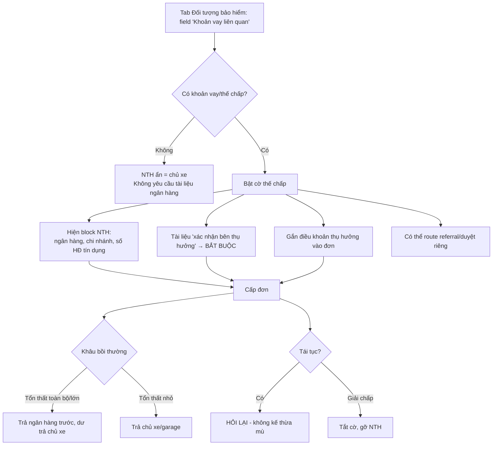

# Luồng nghiệp vụ: Xe thế chấp / Khoản vay → Bên thụ hưởng (NTH)

> Sản phẩm: Motor Comprehensive
> Phạm vi tài liệu: mô tả điểm kích hoạt, hệ quả downstream, xử lý bồi thường, và vị trí đặt field.

---

## 1. Mục đích của luồng

Khi xe **đang thế chấp / trả góp** tại ngân hàng, quyền lợi bồi thường (đặc biệt là **tổn thất toàn bộ**) không còn thuộc trọn về chủ xe mà phải trả cho **ngân hàng với tư cách bên thụ hưởng (NTH)** để cấn trừ dư nợ. Luồng này đảm bảo hệ thống ghi nhận đúng NTH ngay từ khâu cấp đơn, tránh ách tắc khi giải quyết bồi thường.

Trong bảo hiểm phi nhân thọ, NTH **không hiển thị mặc định** (vì mặc định = người được bảo hiểm = chủ xe). Nó **chỉ xuất hiện có điều kiện** — điều kiện đó chính là "xe đang thế chấp".

---

## 2. Điểm kích hoạt — khi nào bật cờ "thế chấp"

Cờ bật từ hai nguồn, kết hợp:

**Nguồn chính — khai báo (một câu hỏi duy nhất, mặc định "Không"):**

> "Xe có đang thế chấp / trả góp tại ngân hàng hoặc tổ chức tín dụng không?"

**Nguồn phụ — hệ thống tự gợi ý (không tự bật cứng, chỉ nhắc):**

- Giấy đăng ký xe tải lên là **bản sao công chứng** kèm xác nhận ngân hàng (vì bản gốc do ngân hàng giữ).
- Hồ sơ đến từ **kênh bancassurance / đại lý liên kết ngân hàng / showroom trả góp**.
- Xe **mới 100%** mua theo hình thức trả góp.

---

## 3. ⚠️ Vấn đề hiện tại: dữ liệu bị trùng ở hai tab

Hiện tại thông tin này đang được thu thập **hai lần, ở hai nơi**:

| Vị trí | Field | Giá trị hiện tại |
|---|---|---|
| Tab **Đối tượng bảo hiểm (xe)** | `Khoản vay liên quan` (Ngân hàng) | **Không** |
| Tab **Khai báo rủi ro** | `Xe có đang thế chấp ngân hàng?` | **Có — Janus Bank** |

➡️ **Hai field này CÙNG một ý nghĩa nhưng đang mâu thuẫn nhau** (một cái "Không", một cái "Có — Janus Bank"). Đây là lỗi kinh điển do không có **single source of truth**. Hệ quả: đơn bảo hiểm không biết lấy dữ liệu nào, khâu bồi thường có thể trả sai người.

**Kết luận:** phải hợp nhất về **một field duy nhất**. Xem mục 7 để biết đặt ở đâu.

---

## 4. Khi cờ = "Có" → chuỗi hệ quả downstream

1. **Hiện block Bên thụ hưởng (NTH)** — trước đó ẩn/tự suy ra = chủ xe. Thu thập:
   - Tên ngân hàng / TCTD
   - Chi nhánh
   - Số hợp đồng tín dụng
   - (Tùy nghiệp vụ) dư nợ hiện tại / thời hạn khoản vay
2. **Thêm tài liệu bắt buộc:** văn bản ngân hàng xác nhận là bên thụ hưởng (dòng "Thông tin bên thụ hưởng" chuyển từ `○ Không cần` → `● Bắt buộc`, chặn nộp nếu thiếu).
3. **Gắn điều khoản thụ hưởng vào đơn:** in điều khoản "quyền lợi bồi thường tổn thất toàn bộ/lớn được chi trả cho [ngân hàng]".
4. **Có thể ảnh hưởng phân cấp duyệt:** đơn có NTH ngân hàng thường cần đúng mẫu điều khoản ngân hàng đó chấp nhận → có thể route qua bước kiểm tra riêng.

Nếu cờ = "Không": NTH ẩn, không yêu cầu tài liệu ngân hàng, không điều khoản thụ hưởng.

---

## 5. Xử lý ở khâu bồi thường

| Loại tổn thất | Người nhận bồi thường |
|---|---|
| **Tổn thất toàn bộ** / mất cắp toàn bộ xe / vượt ngưỡng lớn | Trả **ngân hàng trước** (cấn trừ dư nợ), phần dư (nếu có) trả chủ xe |
| **Tổn thất bộ phận nhỏ** (sửa chữa thông thường) | Thường trả **chủ xe / garage** trực tiếp; ngân hàng không can thiệp (trừ khi HĐ tín dụng quy định khác) |

Không có thông tin NTH trong hồ sơ ⇒ ách tắc ở bước này vì không biết trả cho ai, bao nhiêu.

---

## 6. Tắt cờ / Giải chấp / Tái tục

- Khách **tất toán khoản vay → giải chấp** ⇒ cập nhật cờ về "Không", gỡ block NTH, tài liệu ngân hàng trở lại `○`.
- **Mỗi kỳ tái tục PHẢI hỏi lại** câu này — **KHÔNG kế thừa mù** từ kỳ trước, vì khoản vay có thể đã tất toán (hoặc xe cũ chưa vay nay mới vay). Đây là một trong số ít trường không áp dụng "↻ kế thừa".

---

## 7. Đặt field ở "Đối tượng bảo hiểm" hay "Khai báo rủi ro"?

**Khuyến nghị: đặt ở tab "Đối tượng bảo hiểm (xe)" — và CHỈ ở đó.**

Lý do:

- Tình trạng thế chấp là **thuộc tính pháp lý/tài chính của tài sản** (ai có quyền lợi tài chính trên xe), giống VIN, biển số, giá trị xe — nên thuộc về "đối tượng bảo hiểm".
- Nó **quyết định bên thụ hưởng**, tức cấu trúc quyền lợi của đơn — không phải yếu tố xác suất tổn thất.
- Tab **"Khai báo rủi ro"** nên chỉ dành cho **câu hỏi ảnh hưởng xác suất tổn thất & định phí** (lịch sử tai nạn/claim, mục đích kinh doanh vận tải, vùng ngập). Thế chấp **không làm xe dễ tai nạn hơn** — nó chỉ đổi người nhận tiền, nên về bản chất không phải "rủi ro".

**Cách hợp nhất:**

- Giữ **một field duy nhất** ở "Đối tượng bảo hiểm": `Khoản vay liên quan` → khi ≠ "Không" thì **mở rộng thành block có điều kiện** nhập tên ngân hàng, chi nhánh, số HĐ tín dụng.
- **Xóa** câu hỏi "Xe có đang thế chấp ngân hàng?" khỏi tab Khai báo rủi ro như một field độc lập.
- Nếu vẫn muốn thấy nó ở Khai báo rủi ro, cho hiển thị **read-only, suy ra (derived)** từ field gốc — tuyệt đối không nhập hai lần.
- Logic yêu cầu tài liệu bên thụ hưởng vẫn key off field gốc ở tab Đối tượng bảo hiểm.

---

## 8. Sơ đồ luồng

---

## 9. Quy tắc dữ liệu (validation)

- Nếu `Khoản vay liên quan` ≠ "Không" ⇒ các field NTH (ngân hàng, số HĐ) **bắt buộc nhập**.
- Nếu bật cờ mà chưa có tài liệu "xác nhận bên thụ hưởng" ⇒ cờ `MISSING_DOCUMENT`, chặn nộp.
- Thay đổi giá trị field này ⇒ đánh dấu báo giá **STALE** (cần tính phí lại) và **re-evaluate** yêu cầu tài liệu.
- Cấm tồn tại đồng thời hai nguồn dữ liệu mâu thuẫn cho cùng thông tin thế chấp (single source of truth).

---

*Tài liệu tham chiếu nội bộ · Cập nhật 2026-07-20*

---

## ⚠️ BẢN SỬA ĐỔI 2026-07-20 17:04 (đã áp vào prototype)

1. **Điều kiện kích hoạt** = "chiếc xe được dùng làm TÀI SẢN THẾ CHẤP/BẢO ĐẢM cho khoản vay" — KHÔNG phải "có khoản vay". Tín chấp / thế chấp bằng tài sản khác → xe không thế chấp → NTH = chủ xe.
2. **Thuật ngữ**: "ngân hàng" → "bên cho vay / bên nhận thế chấp" (ngân hàng, công ty tài chính, công ty cho thuê tài chính).
3. **Câu hỏi khai báo mới**: "Chiếc xe này có đang được dùng làm tài sản thế chấp/bảo đảm cho khoản vay không?" + ghi chú tín chấp không kích hoạt.
4. **Nguồn phụ**: kênh bancassurance chỉ là tín hiệu yếu — Seller ≠ bên cho vay, KHÔNG suy NTH từ kênh bán.
5. **Tách 3 thực thể**: Chủ xe/NĐBH · Kênh bán/Seller · Bên thụ hưởng — NTH nhập độc lập. VD: vay tại ngân hàng B, mua BH qua Banca ngân hàng A (A ≠ B).
6. **Block NTH**: field đầu tiên = Loại bên thụ hưởng (NH / cty tài chính / cty cho thuê tài chính). Leasing: bên cho thuê sở hữu xe → NTH = bên cho thuê.
7. **Bồi thường**: "trả bên thụ hưởng (ngân hàng/công ty tài chính) trước".
8. **Giải chấp/hủy**: "cần đồng ý của bên thụ hưởng".
9. **Ràng buộc dữ liệu bổ sung**: NTH cấm derive từ Seller; cờ dựa trên "xe làm tài sản thế chấp", không dựa trên "có khoản vay".
